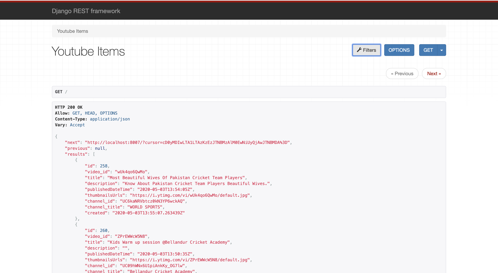

# Youtube Fetch Api
An API to fetch latest videos from youtube sorted in reverse chronological order of their publishing date-time from YouTube for a given tag/search query in a paginated response
I have used Django for the given assignment. Django has advantage because It provides the dashboard and filter options to interacting API.I have used cron jobs method to fetch API for GET request and given below refernce for what is cron-jobs, it is django based library for interacting with API.
Used Cron Jobs [django_cron](https://django-cron.readthedocs.io/en/latest/introduction.html) to fetch videos after every 10 minutes using [Youtube Data Api](https://developers.google.com/youtube/v3/docs/search/list) and save it to the db

## How I made it 
- As this project is based on Django, your system need to have proper python setup, refer [this](https://www.python.org/downloads/)
- Go the project through the terminal and install all dependencies by using typing `pip install -r requirements.txt` in the terminal
- Inside the `setting.py` file, fill the variable `GOOGLE_API_KEYS` with all the API Keys available,the list should be filled as `['API_KEY_1','API_KEY_2',...]`
- For getting an API key I have follow your given reference links for youtube API[this](https://developers.google.com/youtube/v3/getting-started)
- Setup crontab to run Job, Follow [this](https://django-cron.readthedocs.io/en/latest/installation.html)
- Run the server using `python mange.py runserver`

## Screenshots
For visualization through a dashboard one may directly run the app locally and the get the UI provided through django-rest-framework

### Dashboard

### Filters

